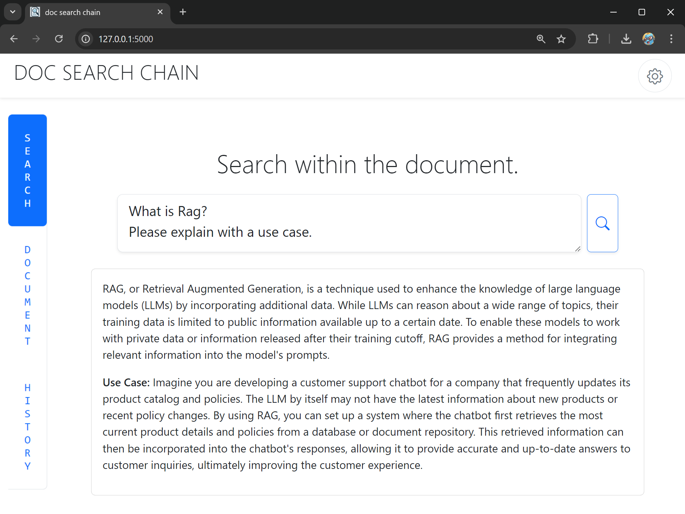

# doc-search-chain
This is a web application that provides a simplified RAG (Retrieval-Augmented Generation) functionality. By allowing documents (in formats such as txt and html) to be read by an LLM (ChatGPT), it offers a feature that answers questions based on the content described in the documents.



## Getting Start
1. ```sh
   docker compose up -d --build
   ```
2. Access http://127.0.0.1:5000/
3. Set the OpenAI API Key from the settings
4. Open the "Document" tab and upload the document you want the LLM to read
5. Press the "Loading the documents" button
6. Finally, open the "Search" tab and ask the LLM a question

## Setting Up Your Local Development Environment
1. ```sh
   mkdir ./docs
   echo '{"default_language": "Japanese", "theme": "light", "api_key": ""}' > app/config.json
   ```
1. ```sh
   python -m venv venv
   ```
1. （for Windows）
   ```sh
   .\venv\Scripts\activate
   ```
1. ```sh
   pip install -r requirements.txt
   ```
1. ```sh
   python .\app.py
   ```
1. Access http://127.0.0.1:5000/


### Run the tests
```sh
python .\tests\test.py
```
